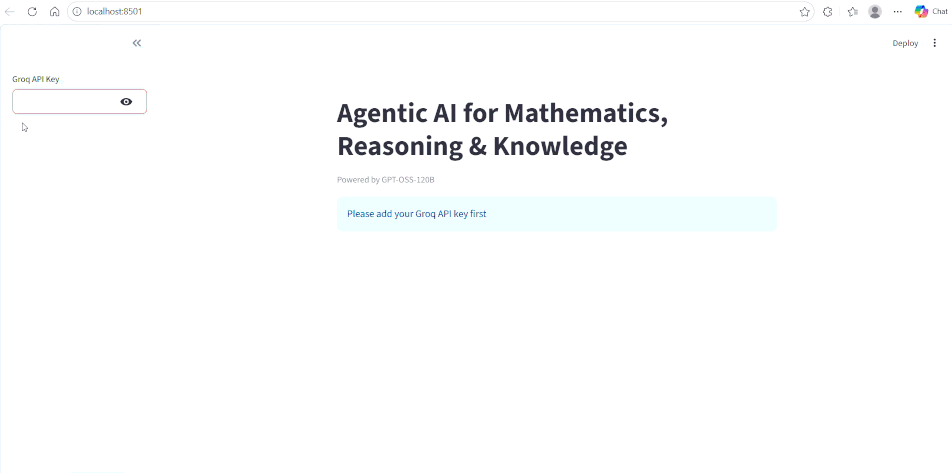

# 🔢 Maths & Knowledge AI Assistant

This is a small AI tool which can help you **solve math questions**, **think logically**, and **find information from Wikipedia**. It’s powered by a **GPT-OSS-120B model** from Groq.

---

## 🛠️ What it can do

- **Maths Calculator:** Solve simple and complex maths questions like `2+2`, `sqrt(16)`, etc.  
- **Reasoning Tool:** Gives step-by-step explanation for logic or reasoning questions.  
- **Wikipedia Search:** Finds quick information about any topic from Wikipedia.  
- **Interactive Web App:** You can ask questions directly and get instant answers.

---

## 📦 Packages Used

- `langchain_groq` – For connecting to GPT-OSS-120B  
- `langchain` – To make chains and agents  
- `langchain_community` – For Wikipedia search  
- `streamlit` – To make a simple web app  
- `math` – For safe math calculations

---


## ⚡ How to Run

1. Clone the project:  
```bash
git clone https://github.com/AnandSharma1107/MathsWithLLM.git
cd MathsWithLLM
```

---

## 💡 Demo



